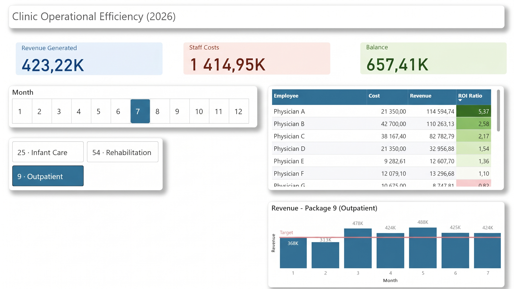
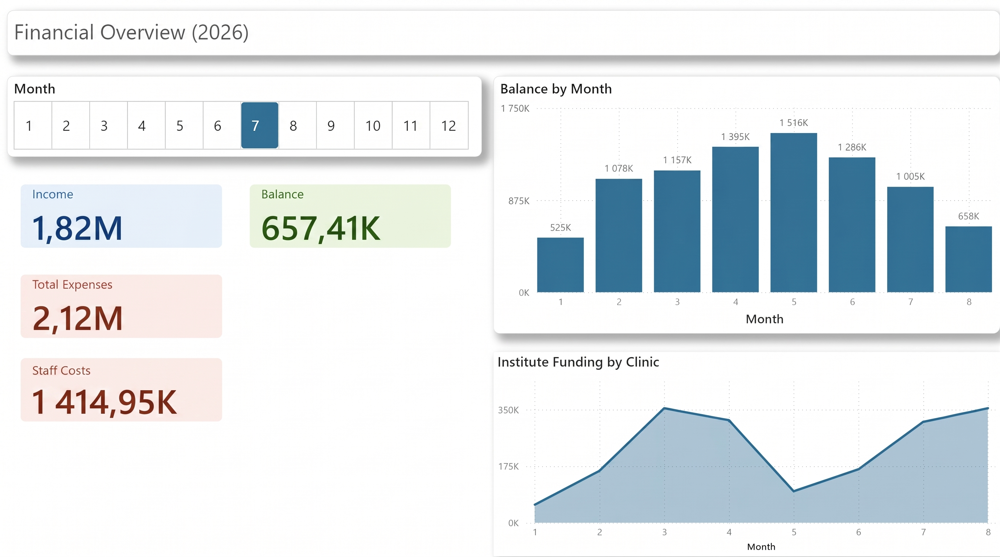

# clinic-operational-analytics

## Deep-Dive Case Studies

Beyond the technical implementation, two business and contractual investigations were conducted:

1. [Reconstructing Missing Contract Data & Funding Appeal Audit](case-studies/01_contract_quota_audit.md)
   - Rebuilt broken revenue calculations from first principles following an EMR export format change.
   - Identified cumulative sum discrepancies against national contract quotas, providing legal evidence for a formal funding revision.

2. [Detecting Hidden Cross-Subsidization & Cash Runway Forecasting](case-studies/02_cross_subsidization_cashflow.md)
   - Reconciled earned payroll vs. accounting ledger charge-offs to isolate medical operations from overhead burdens.
   - Diagnosed an impending liquidity shortfall 3–4 months ahead of time and formulated a two-phase cost-allocation model.

### Visuals

#### 1. Operational Efficiency

#### 2. Financial Overview

## Context
The clinic operates as an outpatient department within a Ukrainian Ministry of 
Health research institute (Institute of Rehabilitation & Balneology). Despite 
its formal status as a sub-unit, the clinic is the institute's primary revenue 
generator, financing the parent institute's operations on a monthly basis.

## Problem
Prior to this project, all operational and financial reporting was done manually 
in Excel across ~2,600 monthly patient encounters and 50 medical staff. This made 
it difficult for management to track staff profitability, monitor compliance with 
the national healthcare payer's (NSZU) contract quotas, or catch reporting errors 
before they affected funding.

## What I built

**Data infrastructure**
- Migrated the clinic's data workflows from fragmented spreadsheets to a 
  centralized PostgreSQL database with automated monthly ingestion pipelines.
- Redesigned the database as a Kimball-style star schema (dimension and fact 
  tables) to support scalable, query-efficient reporting on top of the original 
  operational tables.

**Dashboards (Power BI, built on PostgreSQL views)**

1. **Operational Efficiency** — a staff-level profitability view. Tracks 
   revenue generated vs. staff cost per employee (ROI Ratio), broken down by 
   service package (infant care, rehabilitation, outpatient), with monthly 
   performance tracked against target.

2. **Financial Overview** — a management-level view. Tracks income, expenses, 
   running balance, and the clinic's monthly financial contribution to the 
   parent institute.

**Analysis**
- Formulated a staff ROI model (Revenue Generated / (Staff Cost + Taxes)) now 
  used by leadership to optimize staffing budgets and incentive structures.
- Conducted an audit against national healthcare contract quotas, uncovered a 
  calculation flaw, and prepared the analytical evidence that led to a 14% 
  increase in the clinic's monthly contract funding.

## Impact
- Replaced manual month-end reporting with real-time dashboards for clinic 
  management.
- 14% increase in monthly contract funding following the audit.
- Sole ownership of the data infrastructure retained remotely (relocated to 
  Belgium, December 2025), with reporting handled asynchronously.

## Tech stack
PostgreSQL · SQL · Power BI (Power Query, Data Modeling) · Kimball 
dimensional modeling

## Note on data
All employee names and financial figures shown in the screenshots above have 
been anonymized/obfuscated for public display. The underlying structure, 
relationships, and business logic are representative of the real production 
system.
